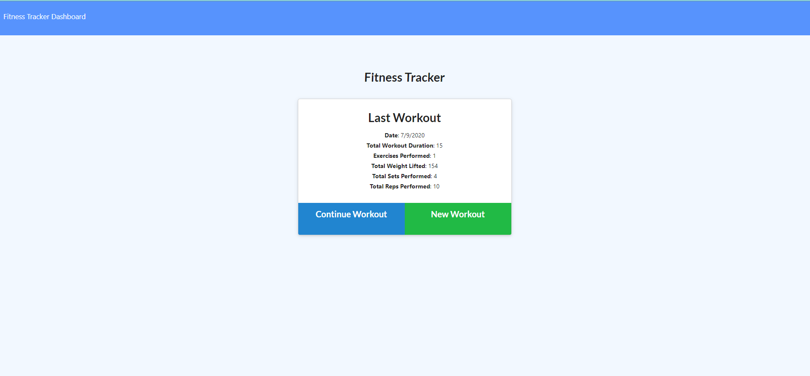
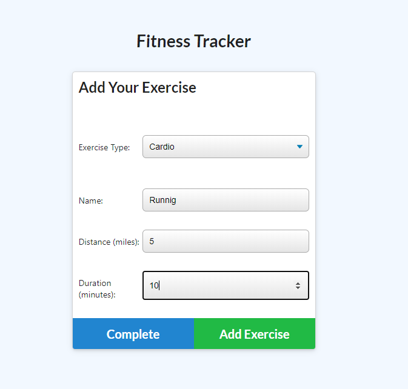
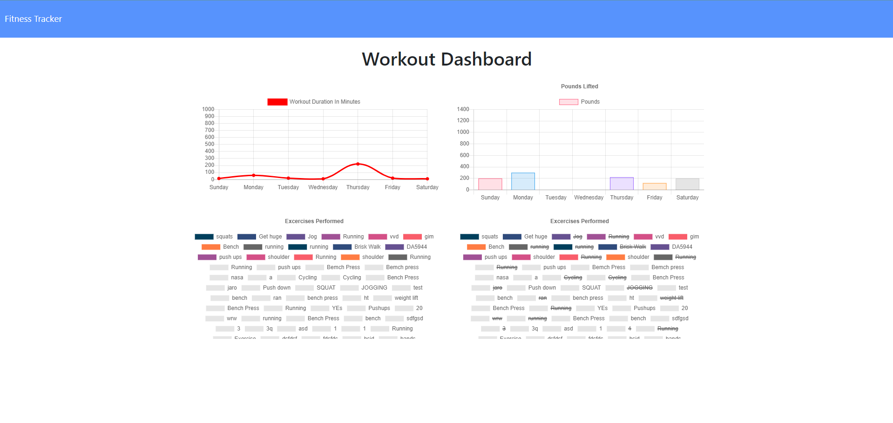

# Fitness Tracker

Track your workouts with Fitness Tracker. The app will keep track of every exercise in your workout. The app dashboard will display weekly summary graphs of all workouts done in a week.

## Getting Started

1. Clone repository. 
2. Check in routes/apiRoutes and comment in block of code if you want the database to be prepopulated with dummy values
3. npm install
4. node server.js

Running seeders/seed.js is optional to have a prepopulated database.

## Site Pictures

1. Homepage displaying last workout

2. Creating Workouts

3. Dashboard

## Built With

* [HTML](https://developer.mozilla.org/en-US/docs/Web/HTML)
* [CSS](https://developer.mozilla.org/en-US/docs/Web/CSS)
* [Bootstrap](https://getbootstrap.com/)
* [Javascript](https://www.javascript.com/)
* [Node.js](https://nodejs.org/en/)
* [Express](https://www.npmjs.com/package/express)
* [MongoDB](https://www.mongodb.com/)

## Deployed Link

* [See Live Site]()

## Author

 * **Victoria Arda** 
